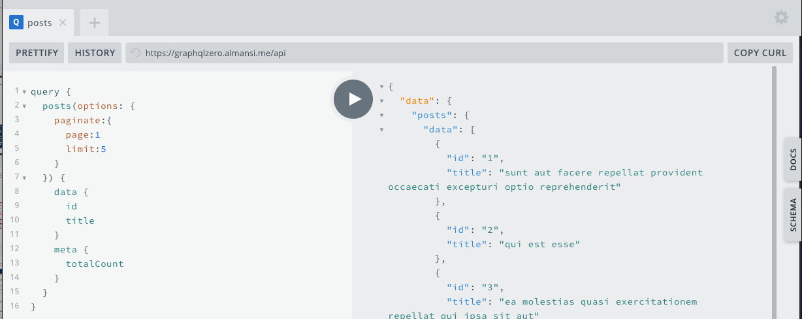
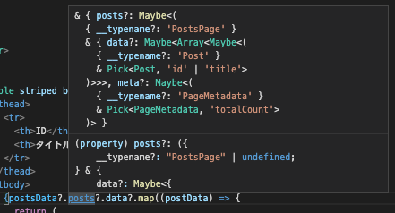

# Overview
Apollo Clientをプロジェクトで3ヶ月使ってみて、フロントのデータソースアクセス周りの実装が簡単だったので、みんなに布教したい。
今後の新しいプロジェクトもApollo Clientを使って欲しいので、紹介します。

# [Apollo Client](https://www.apollographql.com/docs/)とは？
Apollo ClientとはGraphQL APIをシンプルにクライアント側で操作するためのライブラリ。

# [GraphQL](https://graphql.org/)とは
GraphQL自体はフレームワークや特定の技術を指すのではなく、データに対するクエリ言語の仕様。

## GraphQLを試す
[GraphQL Zero Playground](https://graphqlzero.almansi.me/api)


<details>
<summary>サンプル GraphQL</summary>
```graphql
query {
  posts(options: {
    paginate:{
      page:1
      limit:3
    }
  }) {
    data {
      id
      title
      user{
        id
        username
      }
    }
    meta {
      totalCount
    }
  }
}
```
```json
{
  "data": {
    "posts": {
      "data": [
        {
          "id": "1",
          "title": "sunt aut facere repellat provident occaecati excepturi optio reprehenderit",
          "user": {
            "id": "1",
            "username": "Bret"
          }
        },
        {
          "id": "2",
          "title": "qui est esse",
          "user": {
            "id": "1",
            "username": "Bret"
          }
        },
        {
          "id": "3",
          "title": "ea molestias quasi exercitationem repellat qui ipsa sit aut",
          "user": {
            "id": "1",
            "username": "Bret"
          }
        }
      ],
      "meta": {
        "totalCount": 100
      }
    }
  }
}
```
</details>


# Apollo Clientが良いなぁと思った理由
- GraphQLの学習コストが低い
  - なんとなく、どんな値が返ってくるか予想できる
- Playgroundで試しながら開発できる
- PlaygroundでAPIのドキュメントを確認できる
- データソースから取得したデータが、型定義された状態で取得できる
  - [graphql-codegenerator](https://graphql-code-generator.com/)の導入が必要
- データソースへの問い合わせにおいて、問い合わせの状態（ロード中・完了）による処理分けが簡単
  - [graphql-codegenerator](https://graphql-code-generator.com/)の導入が必要

# Actionが実行されてからViewに表示されるまでの部分で書かれるロジックをGraphQLで
参考：[世のフロントエンドエンジニアにApollo Clientを布教したい](https://qiita.com/seya/items/26c8a0dc549a10efcdf8)

URLにアクセスして画面が表示されるまでに、以下のようなロジックがある場合、GraphQLではどのような実装をするのか示します。
- 1.データソースへの問い合わせ
- 2.データをデータソースに対するリクエストのパラメータに合う形に加工する
- 3.取得したデータをViewが使いやすい形に加工する
- 4.Veiwに表示する

[サンプル](https://github.com/NoriyukiMatsumoto/apollo-client-sample)を作成しました。

## 1.データソースへの問い合わせ
[App.tsx](https://github.com/NoriyukiMatsumoto/apollo-client-sample/blob/master/src/App.tsx)
```javascript
  const {
    data: postsData, // データ
    loading: postsLoading, // ローディング状態
    error: postsError, // エラー内容
    refetch: postsRefetch, // データ再取得
  } = usePostsQuery({
    variables: {
      options: {
        paginate: {
          page: 1,
          limit: 5,
        },
      },
    },
    fetchPolicy: "cache-and-network",
  });
```
[graphql-codegenerator](https://graphql-code-generator.com/)で生成されたHooksを使用するとデータソースへの問い合わせができます。

## 2.ローカルのデータをデータソースに対するリクエストのパラメータに合う形に加工する & 3.取得したデータをViewが使いやすい形に加工する
Viewが扱いやすいようなクエリを書けばいいだけ。
```javascript
import gql from "graphql-tag";
export const QUERY_POST = gql`
  query posts($options: PageQueryOptions) {
    posts(options: $options) {
      data {
          id
          title
      }
      meta {
          totalCount
      }
    }
  }
`;
```
型が定義されるので使いやすい！



## 4.Veiwに表示する
好きなように表示する。

```tsx
  {postsData?.posts?.data?.map((postData) => {
    return (
      <tr key={postData?.id}>
        <td>{postData?.id}</td>
        <td>{postData?.title}</td>
      </tr>
    );
  })}
```